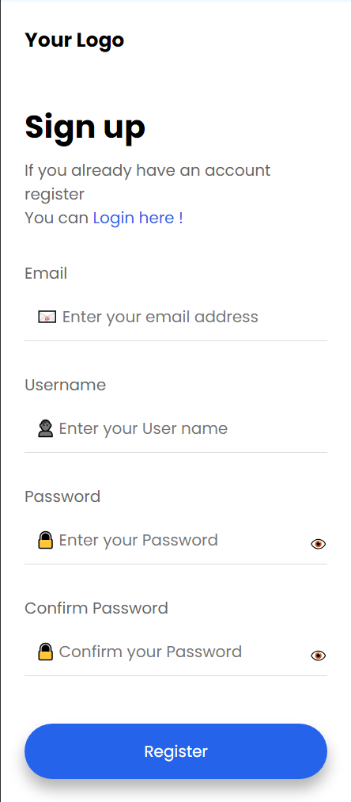

# Лабораторная работа №3
Web-программирование (HTML+CSS only, Google Poppins Font)  
## Dependencies
Internet connection
## Usage
1. Cloning a repo  
   ```git clone https://github.com/AD-158/Lab_works.git```
2. Go to the project directory  
   ```cd Lab_works```
3. Open HTML (needed page) page via browser
### View results
1. LR1  
   Макет [Figma](https://www.figma.com/design/TjjTlE5G2TS2RhcRPsPL6e/%D0%9B%D0%B0%D0%B1%D0%BE%D1%80%D0%B0%D1%82%D0%BE%D1%80%D0%BD%D0%B0%D1%8F-1.-GoTrip?node-id=0-1&t=lLLdHwaurb3rg1wq-1)  
     
2. LR4  
   Макет [Figma - Вариант 3](https://www.figma.com/design/P4e5U2QniPD0KvU2xb7OFb/Cards?node-id=0-1&t=1ThO0xTkGhKoQt5v-1)  
   
3. LR5  
   Макет [Figma - Вариант 3](https://www.figma.com/design/jeOPxB60ASk6J9tIZ94J05/Forms_2?no)  
   * Desktop  
      
   * Mobile  
      